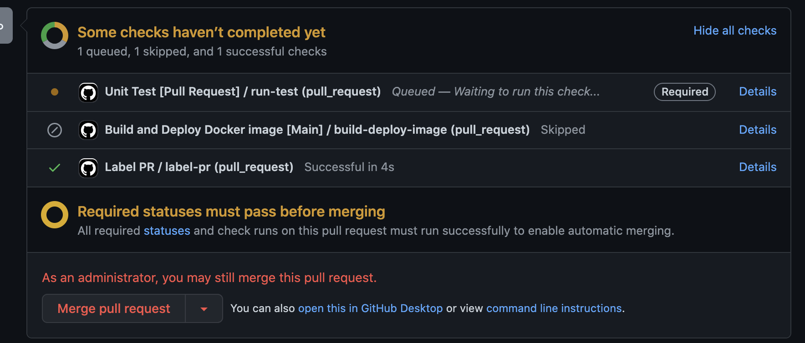

# Pipelines

We use Github Actions as a service provider to orchestrate our CI/CD pipelines.

All workflows are contained within the `.github/workflows` directory.

### unit-test.yml
This workflow is triggered whenever a PR is created, updated or reopened. The workflow runs unit tests (npm test).

A Branch protection rule has been set for the `main` branch which requires this check/workflow to pass sucessfully before a PR can be merged into the `main` branch.

### build-deploy-main.yml
This workflow is triggered when a PR to the `main` branch is merged. The worklfow builds and deploys a docker image with tag `main` to Amazon ECR.

N/B: Due to a limitation with Github actions, the workflow is triggered when a PR is closed (not merged) and an if condition is used to skip/continue the workflow jobs. This means that this workflow would be triggered when a PR is dismissed and not necessarilly merged.

To circumvent this, since merging a PR triggers a push into the target branch, you can change the workflow to be triggered on every push to the `main` branch and set branch protection rules to disable direct commits (besides PRs) into the `main` branch.

### build-deploy-release.yml
This workflow is triggered when a new release is published and an if condition is used to skip/continue the workflow jobs depending on whether the release target branch is `main`. The workflow builds and deploys to Amazon ECR a docker image with tag = the tag created by the release.

N/B: Just like with the `build-deploy-main` workflow, this workflow is always triggered when a release is published because of limitations with Github Actions.

### team-label.yml
This workflow is triggered whenever a PR is created or updated. It sets the correct team label based on the location of file changes. 

The `labeler.yml` file contains a list of labels and path globs to match to apply the label.

## Authenticating to Amazon ECR
There are several ways to authenticate against Amazon ECR (Access keys, IAM roles) but for the sake of simplicity, the workflows use access keys. Following best practices, Least privilege Permissions were granted to the credentials.